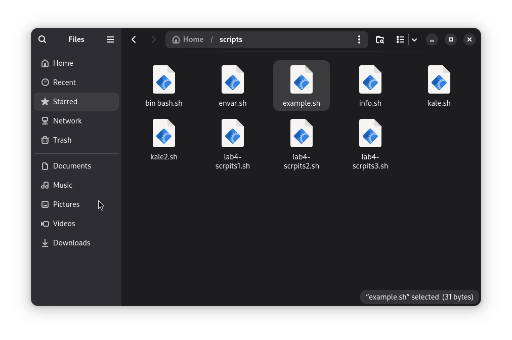
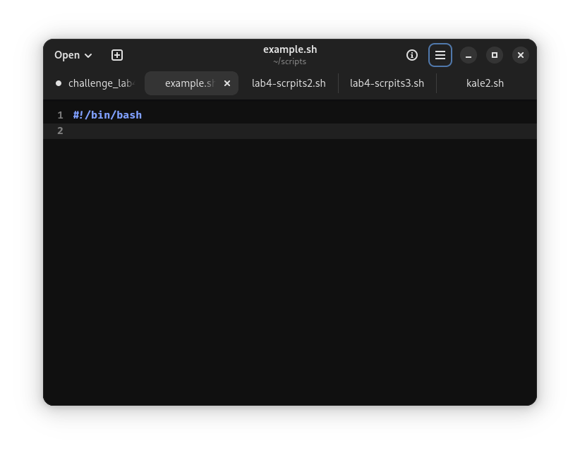
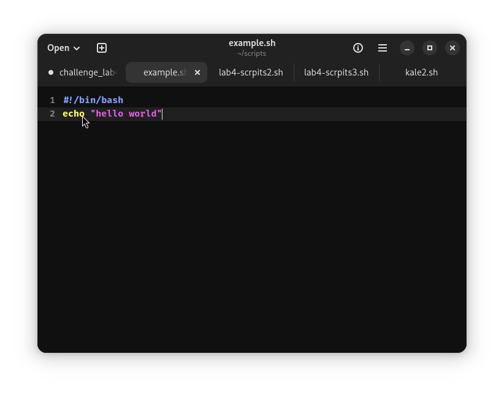
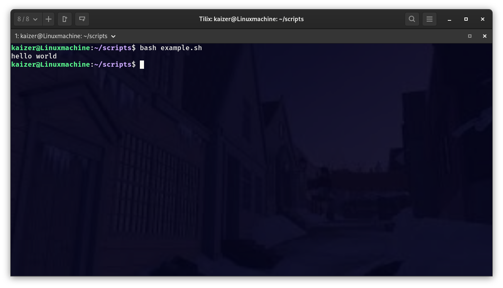

## Notes 4

### 1. How to install and remove software using the APT command

#### To install software
* sudo apt install [...]

#### To remove software
* sudo apt remove [...]

* sudo apt purge [...]

#### Honorable mention
* sudo apt auto (either clean, remove, or purge)

* can be in combination to wipe the software off completely

### 2. How to create a shell script

#### Step 1. Create a the file "anyname".sh
*created either in the text editor with the .sh extension or in the file manager.

#### Step 2. Add shell declaration
  
  * #!/bin/bash

#### Step 3. Add your code

  * Using echo for example can display a message

#### Step 4. Execute the script

* Please note that adding the script declaration alone would leave the terminal returning nothing; This does not mean it did not run.
  
